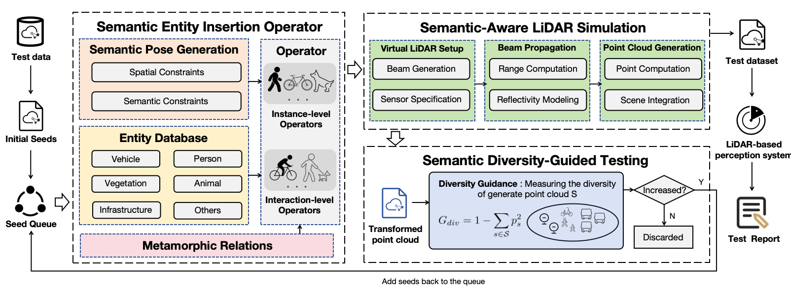
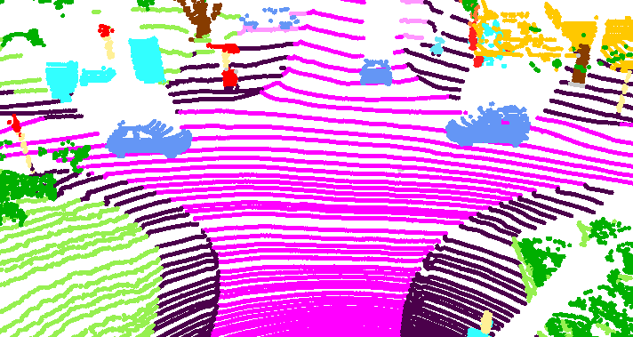

# Selda

This repository provides the code of the paper "**Selda: Semantic-Aware LiDAR Perception Testing via Realistic and Diverse Entity Insertion**"

[[website]](https://sites.google.com/view/selda-main)



Selda employs a semantic-aware and physics-guided approach to render realistic and diverse entity instances using a virtual LiDAR sensor for testing LiDAR-based semantic perception systems.

Figure above presents the high-level workflow of Selda. Given a background LiDAR point cloud scene and an entity instance selected from a large-scale semantic entity database, Selda first executes the semantic entity insertion operator to determine valid compositions such as single entities or structured interactions like dog-walker and generate physically plausible poses constrained by spatial and semantic scene context. Then the semantic-aware LiDAR simulation module renders the selected entities into high-fidelity point clouds simulating geometry intensity and per-point semantic labels based on a physics-based LiDAR model RCLB that accounts for laser propagation surface reflectivity incidence angle and atmospheric effects. The module further integrates the rendered entity point clouds into the original scene while rigorously handling occlusion. These components form Selda’s semantic-aware test data generation pipeline. Finally the framework boosts testing efficiency and error exposure via a semantic diversity-guided strategy which actively selects transformations that maximize categorical balance measured by Gini impurity enabling scalable automated discovery of perception failures through semantic-level metamorphic relations.

<p align="center">
  
</p>

## The structure of the repository
Folder Structure:

```
Selda
├── _assets     
│   └── objects                          # object database                 
├── _data							
│   ├── semanticKITTI                    # SemanticKITTI dataset
├── configs                              # Selda tool configuration
├── drivence                             # Core Selda working code
├── entry                                # Entry points for Selda
├── eval_tools                           # Tools for evaluation
├── lidar_core                           # Package building for Selda lidar module
├── scene_example                        # Example scene JSON files
├── selda_rq_scripts                     # Scripts for experiments
├── build_script.py                      # Package building script
├── demo.py                              # Quick-start demo
└── main.py                              # Selda main file
```
## Installation

We implement the Selda upon PyTorch 2.8.0 and Python 3.9.0. All experiments are conducted on a server with a 13th Gen Intel Core i7-13650HX CPU (2.60 GHz), 16 GB RAM, and an NVIDIA GeForce RTX 4060 Laptop GPU (8 GB VRAM).

Run the following command to install the dependencies

```bash
pip install -r requirements.txt
python build_script.py   --artifact-dir lidar_core   --dist-dir lidar_core_dist   --name lidar_core   --version 1.0.0
pip install lidar_core_dist/lidar_core-1.0.0-py3-none-any.whl
```

## Download Datasets and Object Assets
- Download SemanticKITTI datasets from this [link](https://semantic-kitti.org/dataset.html) to `Selda/_data/semanticKITTI`
- We provide both a tiny version (for quick start and debugging) and the full version of the object dataset. You can download them via the link below:
  - [Download object assets](https://pan.baidu.com/s/10XGWBmp3sO5ElWdfCoumKA?pwd=8nc7)
## Usage
### Configuration
Selda is highly configurable via YAML files under `configs/`. You can directly edit these files to control asset loading, dataset paths, physics simulation, and test generation behavior
#### 1. `assets/objects.yml`  
Defines the **entity database** — categories, model names, sizes, and coordinate alignment.
- **Add new entities**: Extend categories like `vehicles`, `pedestrians`, etc., with new model names (e.g., `"Drone_1"`), provided the `.obj` file exists at `_assets/objects/Drone_1/models/model_normalized.obj`.
- **Adjust object sizes**: Modify bounding box sizes (`[L, W, H]` in meters) for realism:
  ```yaml
  "Dog_1": [0.5, 0.3, 0.4]  # smaller pet
  ```
- **Change alignment convention**: 
  ```yaml
  # Use camera (KITTI-style) alignment
  align_in_camera_coordinate: [0, pi/2, pi]
  # align_in_lidar_coordinate: [...]  # comment out
  ```

#### 2. `dataset/semantic_kitti.yml`  
Specifies **input/output paths** and global data structure.
- **Source dataset path**:
  ```yaml
  source_dataset:
    root_dir: "_data/my_custom_kitti"   # ← point to your SemanticKITTI data
  ```
- **Output directory**:
  ```yaml
  generated_dataset:
    output_dir: "_outputs/RQ1_car_only"
  ```

#### 3. `intensity/intensity.yml`  
Controls **physics-based LiDAR intensity simulation** using the RCLB model.
- **Material reflectance** (`p_lambda`), **diffuse ratio** (`kd`), **roughness** (`m`), **threshold angle** (`theta_T`):
  ```yaml
  cars:
      p_lambda: 0.6
      kd: 0.6
      m: 0.15
      theta_T: 25 
  ```
> Parameters are calibrated for **905nm LiDAR** (e.g., Velodyne HDL-64E).

#### 4. `sensors/lidar/kitti_lidar.yml`
Defines the virtual LiDAR sensor (modeled after **Velodyne HDL-64E**), including:  
- Sensor position and field of view (`lidar_position`, `horizontal/vertical` angles)  
- Scan resolution (`beam_number`, `angular_resolution`)  
- Maximum detection range (`range`)  
- Measurement noise and dropouts (`noise_variance`, `loss_rate`, etc.)  
- Coordinate convention (`yaw_rotation_counterclockwise`)

#### 5. `obj_insert_confg.json`
Defines **semantic entity insertion operators** as pre-assembled object groups, specifying:
- `relative_displacement`: `[x, y, z]` offset (in meters) of each member relative to the group origin  
- `relative_rotation`: yaw angle (in radians) of each member within the group  
- `semantic_label`: SemanticKITTI-compatible label (e.g., `252` = *car*, `258` = *truck*, `15` = *motorcycle*)  

Each group (e.g., `"car_1"`) represents a single-entity operator; multi-entity groups (e.g., `"dog-walker"`) encode structured interactions (riding, pushing, etc.) via coordinated displacements.

#### 6. `obj_insert_config.yml`
Related to the group insertion generation method, and specifies the location of the semantic entity insertion operators JSON.

#### 7. `project_structure.yml`
The entry file defines your Selda project path. Please modify `root_dir` to your project before running.

### Quick Start
After installing all the necessary configurations and downloading the tiny version of assets, you can run the demo.py file we provided to generate test data:

```bash
python demo.py 
```
The result can be found at `Selda/_outputs/semanticKITTI`.

### Comprehensive Tool Usage
After installing all the necessary configurations and downloading the full version of the resources, you can run the following command to use the full functionality of Selda：
```bash
# Insert three copies of Car_1 into frame 1
python main.py point_cloud --bg_index 1 --obj_name Car_1 --count 3

# Insert the object groups defined in configs/obj_insert_config.yml
python main.py group --bg_index 0

# Insert the objects defined in a logic-scene JSON
python main.py scene --logic_scene_path scene_example/car_example.json
```

## Experiments
We evaluate **Selda** on five state-of-the-art LiDAR semantic segmentation models using the SemanticKITTI validation set (sequence `08`). Our goal is to answer four research questions (RQ1–RQ4) by:
1. Generating physically realistic and semantically diverse test cases via entity insertion;
2. Running inference on each System Under Test (SUT);
3. Quantifying performance degradation, diversity gain, and root causes of failures.

All SUTs must output `.label` predictions in **SemanticKITTI format** (see model-specific notes below). The evaluation workflow is unified:  
🔹 *Generate* → 🔹 *Infer* → 🔹 *Evaluate*.

### Model Configuration

| Model | Repo |
|-------|------|
| **CENet** | [huixiancheng/CENet](https://github.com/huixiancheng/CENet) |
| **LSK3DNet** | [FengZicai/LSK3DNet](https://github.com/FengZicai/LSK3DNet) |
| **PVKD** | [cardwing/codes-for-pvkd](https://github.com/cardwing/codes-for-pvkd) |
| **Cylinder3D** | [xinge008/Cylinder3D](https://github.com/xinge008/Cylinder3D) |
| **SalsaNext** | [TiagoCortinhal/SalsaNext](https://github.com/TiagoCortinhal/SalsaNext) |


### RQ1: Metamorphic Transformations
We generate **3,200 test cases** (32 operators × 100 seeds) by inserting entities (e.g., `08_car`, `08_dog-walker`) into background frames from `selda_rq_scripts/RQ1/bgs_rq1_n.txt`.

```bash
# 1. Configure paths in configs/dataset/semantic_kitti.yml:
#    source_dataset.root_dir = "_data/semanticKITTI/dataset"
#    generated_dataset.output_dir = "_outputs/semanticKITTI_RQ1/sequences/08"

# 2. Generate test cases
python selda_rq_scripts/RQ1/RQ1.py

# 3. Run inference on all 33 sequences (08_, 08_car, ..., 08_dog-walker)
#    → save to: ${PRED_ROOT}/<seq_name>/sequences/08/predictions/

# 4. Evaluate
python eval_tools/evaluate_iou_RQ1.py \
  --dataset "_data/semanticKITTI/dataset" \
  --predictions "${PRED_ROOT}"
```

### RQ2: Testing Effectiveness   
We generate **1,000 test cases** (200 seeds × 5 trials) using `SELECTION_MODE`:
- `"best_of_all"` → Selda (Gini-guided)  
- `"no_guidance"` → SeldaNG (unguided baseline)  
- Compare with **LiDARMutation** [Christian et al. ICSE’23].

```bash
# 1. In selda_rq_scripts/RQ2/RQ2.py, set:
#    SELECTION_MODE = "best_of_all"   # or "no_guidance"

# 2. Configure dataset paths (same as RQ1)

# 3. Generate
python selda_rq_scripts/RQ2/RQ2.py

# 4. Run inference → save to: ${PRED_DIR}/sequences/08/predictions/

# 5. Evaluate
python eval_tools/evaluate_iou_RQ2.py \
  --dataset "_data/semanticKITTI/dataset" \
  --predictions "${PRED_DIR}" \
  --split valid --include_inserted_object
```

### RQ3: Testing Diversity
Reuse RQ2’s 1,000 cases. Compute distribution shifts between original/augmented scenes using 4 metrics.

```bash
# Run on model-specific predictions (e.g., CENet)
python selda_rq_scripts/RQ3/evaluate_diversity_metrics.py \
  --original_gt "_data/semanticKITTI/dataset/sequences/08" \
  --original_pred "_outputs/models/CENet/seq08_orig" \        # predictions on original 08
  --transformed_gt "_outputs/semanticKITTI_RQ2/sequences/08" \ # GT with inserted entities
  --transformed_pred "_outputs/models/CENet/seq08_aug" \      # predictions on augmented data
```

### RQ4: Fault Analysis
We generate **500 semantic-violation cases** (e.g., cars on vegetation, pedestrians in lanes) by enabling unnatural placement.

```bash
# 1. In selda_rq_scripts/RQ2/RQ2.py, set:
MERGE_SURFACES = True   # allow entities on semantically invalid surfaces

# 2. Generate 500 cases (modify RQ2.py to use 500 seeds from RQ4/bgs.txt)
python selda_rq_scripts/RQ2/RQ2.py

# 3. Reuse RQ2 evaluation script (same command as RQ2)
python eval_tools/evaluate_iou_RQ2.py ... 
```
